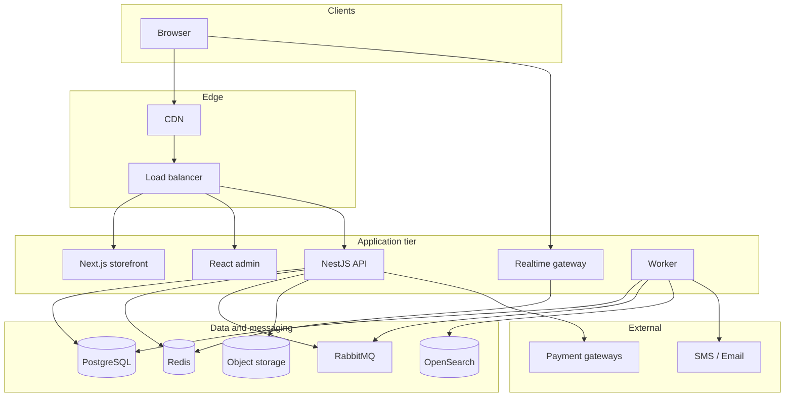

# 6. System architecture

## 6.1 Architecture style

**Modular monolith** — one codebase, domain modules, deployed as **three runtime processes** (API, realtime gateway, background worker). Modules can be split into services later if traffic requires it.

## 6.2 Runtime components

| Component | Responsibility | Technology |
|-----------|----------------|------------|
| Storefront | Public pages, SEO, buyer/seller account UI | Next.js (SSR) |
| Admin app | Staff back-office (IP + 2FA) | React |
| API process | REST endpoints, business rules | NestJS (TypeScript) |
| Realtime process | Live bids, countdown, chat, notifications | WebSocket + Redis pub/sub |
| Worker process | Queue consumers, scheduled jobs | NestJS worker |
| PostgreSQL | System of record | PostgreSQL 16 |
| Redis | Sessions, cache, rate limits, locks, live auction cache | Redis 7 |
| OpenSearch | Search, autocomplete, filters | OpenSearch 2.x |
| Message queue | Domain events, background jobs | RabbitMQ |
| Object storage + CDN | Images, KYC, invoices, backups | S3-compatible |

## 6.3 Module map

Domain modules: **identity**, **catalog**, **listings**, **auctions**, **offers**, **search**, **cart**, **checkout**, **payments** (ledger, escrow, payouts), **orders**, **shipping**, **returns**, **disputes**, **feedback**, **messaging**, **notifications**, **seller**, **admin**, **fraud**.

### Dependency rules

1. A module **owns its tables** — no cross-module SQL.
2. Cross-module access only via **public service interfaces** or **events**.
3. Call direction examples: checkout → cart, listings, payments, orders; auctions → listings, payments, fraud; orders → payments, shipping, notifications; disputes → orders, payments, messaging.
4. **search**, **notifications**, **feedback**, **admin** consume events; nothing depends on them.
5. **No circular dependencies** (enforced in CI).
6. State changes that others care about write an **outbox** row in the **same DB transaction**.

## 6.4 Technology stack

| Layer | Choice |
|-------|--------|
| Backend | Node.js, NestJS (TypeScript) |
| Web | Next.js storefront; React admin |
| Database | PostgreSQL 16 + JSONB |
| Cache / locks | Redis |
| Search | OpenSearch |
| Queue | RabbitMQ |
| Real-time | WebSocket (Socket.IO) |
| Files | S3-compatible + CDN |
| Delivery | Docker, GitHub Actions, Terraform or shell |
| Observability | Prometheus, Grafana, Sentry, central logs |

## 6.5 Logical deployment (reference)

