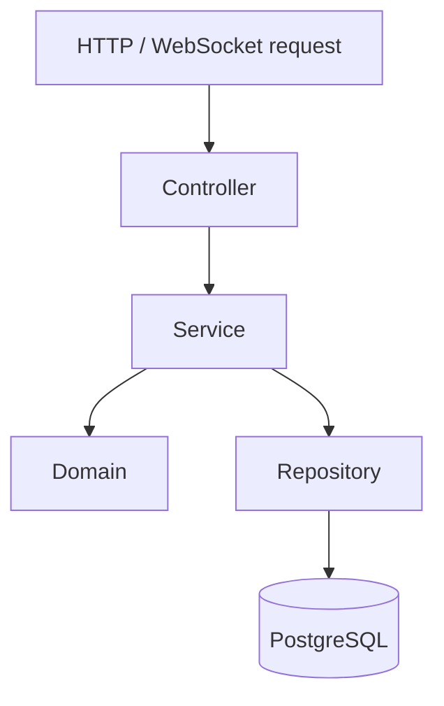
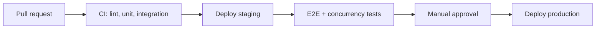

# 7. Development architecture

## 7.1 Layers inside every module

Calls only go **downward**. Business rules stay testable; the database is hidden behind repositories.



| Layer | Responsibility |
|-------|----------------|
| **Controller** | Validate input, map HTTP to use cases. No business logic. |
| **Service** | One use case per method; one DB transaction; write **outbox** events. |
| **Domain** | Pure rules (proxy bid, order state machine, fee math). No framework imports. |
| **Repository** | Only layer that executes SQL / ORM queries. |

## 7.2 Repository structure (target monorepo)

Current repo: **Next.js storefront** at root (`src/`). Full platform layout:

```
marketplace/
  apps/
    api/          # NestJS — identity, catalog, listings, auctions, …
    realtime/     # WebSocket gateway (bids, chat)
    worker/       # Queue consumers + cron
    web/          # Next.js storefront (or root `src/` during bootstrap)
    admin/        # React admin panel
  packages/
    shared-types/ # DTOs, enums, OpenAPI-generated client
    ui/           # Design system (storefront + admin)
  infra/          # Docker Compose, env templates, deploy scripts
  docs/           # Architecture, OpenAPI, ER diagrams, runbooks
  .github/        # CI/CD workflows
```

See [`../infra/README.md`](../infra/README.md) for local stack.

## 7.3 Development practices

- **Contract first** — OpenAPI before implementation; shared generated types.
- **Trunk-based development** — Short branches, PR review, feature flags for WIP.
- **Migrations** — Versioned, backward compatible, zero-downtime deploys.
- **Design system** — Shared tokens and components for storefront and admin.
- **Environments** — Local (Docker Compose), staging (masked data), production.

## 7.4 Delivery pipeline and testing



| Test type | Coverage |
|-----------|----------|
| Unit | Proxy bidding, fees, order FSM, ledger balancing |
| Integration | API + real DB; payment webhooks (including duplicates) |
| Concurrency | Simultaneous bids; stock reservation under load |
| E2E | Register → list → bid → pay → ship → escrow release → feedback |
| Load | Search, bidding, checkout (targets in [§10](./10-system-design-and-flows.md)) |
| Security | Dependency/secret scan; OWASP Top 10 review |
