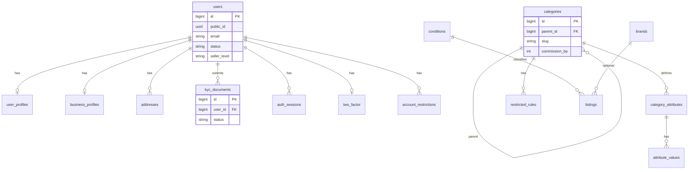
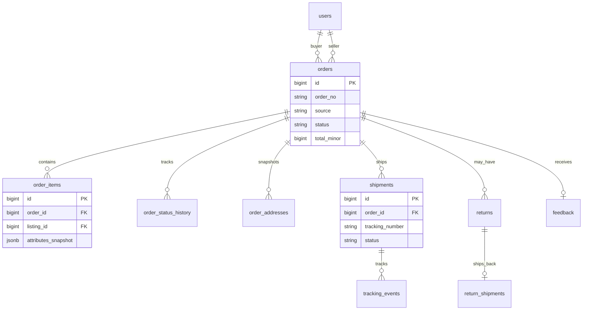
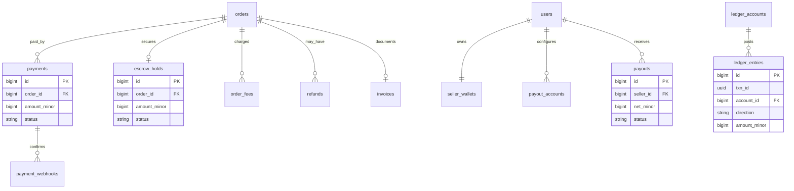
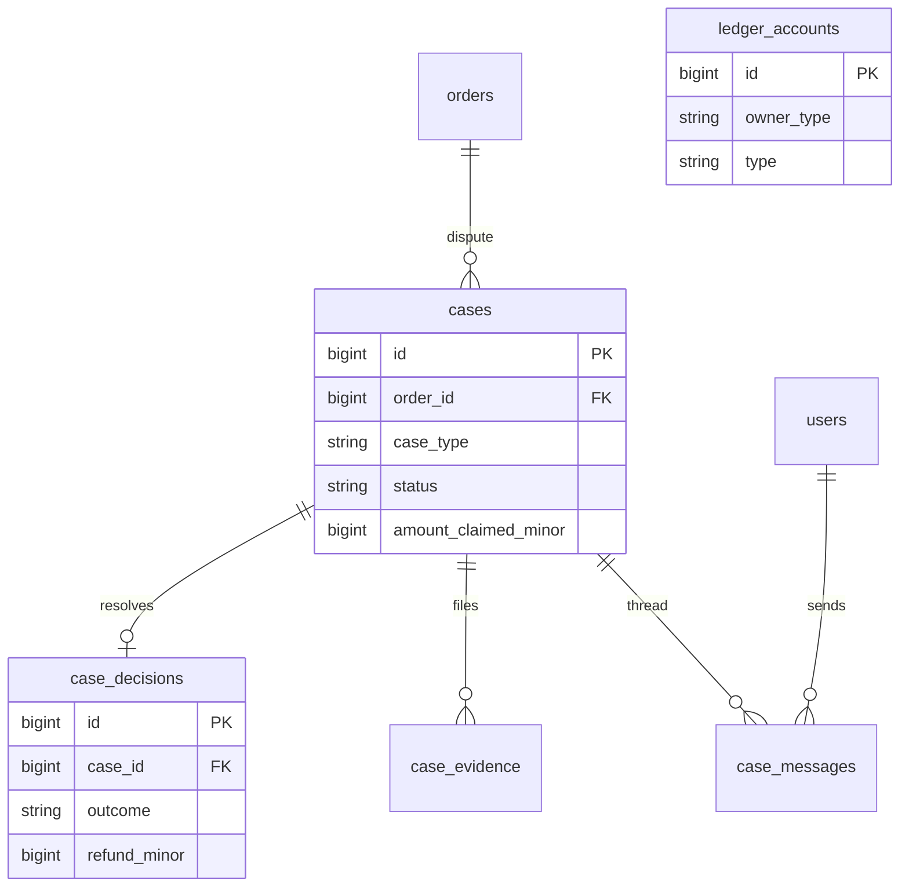

# 9. ER diagrams

Six diagrams (proposal §9). Cardinality: `||--o{` = one-to-many; optional parent shown with `o|--`.

Full table definitions: proposal **§5**.

---

## Diagram 1 — Users and catalog



---

## Diagram 2 — Listings and auctions

```mermaid
erDiagram
  users ||--o{ listings : sells
  categories ||--o{ listings : categorizes
  listings ||--o{ listing_media : has
  listings ||--o{ listing_variations : has
  listings ||--|| listing_policies : has
  listings ||--o{ listing_fees : incurs
  listings ||--|| auctions : auction_format
  listings ||--o{ bids : receives
  increment_rules ||--o{ auctions : applies
  users ||--o{ bids : places
  users ||--o{ blocked_bidders : blocked_as

  listings {
    bigint id PK
    uuid public_id
    bigint seller_id FK
    string listing_type
    string status
    jsonb attributes
  }

  auctions {
    bigint listing_id PK_FK
    bigint current_price_minor
    bigint leader_id FK
    timestamptz end_at
    string status
  }

  bids {
    bigint id PK
    bigint listing_id FK
    bigint bidder_id FK
    bigint amount_minor
    bigint max_minor
    timestamptz placed_at
  }
```

---

## Diagram 3 — Best Offer

```mermaid
erDiagram
  listings ||--o{ offers : receives
  listings ||--o| offer_rules : configures
  users ||--o{ offers : buyer
  users ||--o{ offers : seller
  offers ||--o{ offer_counters : negotiates
  listings ||--o{ second_chance_offers : after_unpaid

  offers {
    bigint id PK
    bigint listing_id FK
    bigint buyer_id FK
    bigint price_minor
    string status
    timestamptz expires_at
  }

  offer_counters {
    bigint id PK
    bigint offer_id FK
    string from_role
    bigint price_minor
  }

  offer_rules {
    bigint listing_id PK_FK
    bigint auto_accept_minor
    bigint auto_decline_minor
  }
```

---

## Diagram 4 — Orders and fulfilment



---

## Diagram 5 — Payments and payouts



---

## Diagram 6 — Disputes and ledger (cases)



### Tables omitted from diagrams

Carts, coupons, conversations, messages, notifications, fee rules, admin/system tables (see proposal §5.5–5.9) attach to **users**, **listings**, or **orders** with the same pattern.
