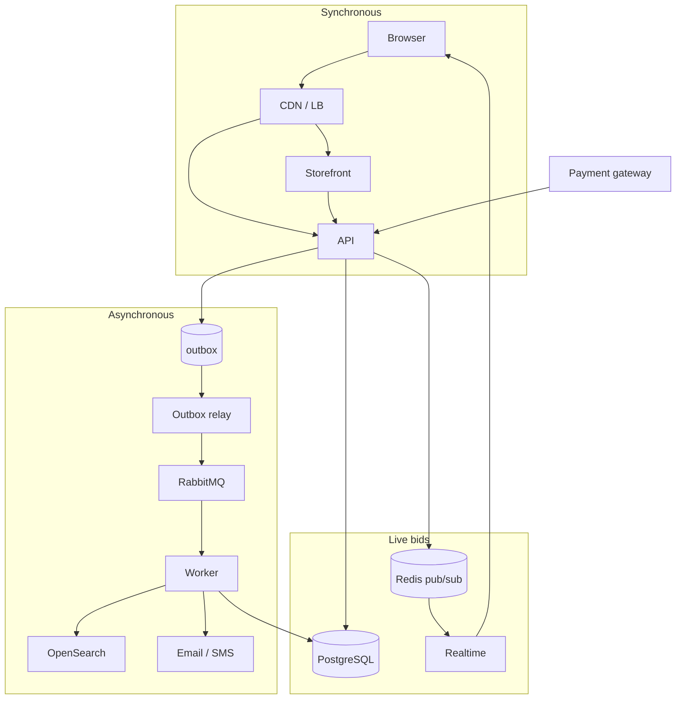
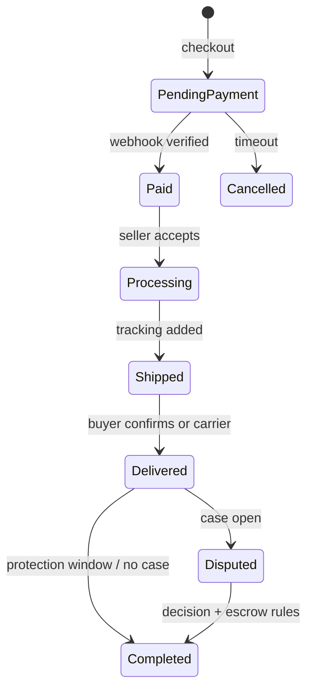

# 10. System design and key flows

## 10.1 Request paths



- **Writes** always go through the **API** (not direct DB from browser).
- **External services** (payments, SMS, email, couriers) called from **API** and **workers** only; webhooks hit the API.

## 10.2 Key flows

### Placing a bid

```mermaid
sequenceDiagram
  participant B as Browser
  participant API as API
  participant R as Redis lock
  participant DB as PostgreSQL
  participant RT as Realtime

  B->>API: POST /bids (idempotency key)
  API->>R: Acquire auction lock
  API->>DB: BEGIN; lock auction row
  API->>API: Validate rules + proxy bid
  API->>DB: Insert bid; update auction; outbox events
  API->>DB: COMMIT
  API->>R: Publish state
  R->>RT: Push to watchers
  API->>B: 200 + result
```

1. Browser sends bid with **idempotency key**.
2. API: Redis lock + DB transaction with **row lock** on `auctions`.
3. Validate: running, before `end_at`, not seller, not blocked, amount ≥ current + increment.
4. Apply **proxy bidding** ([§11](./11-methods-and-algorithms.md)); soft close; write outbox (`new_bid`, `outbid`, `reserve_met`).
5. After commit: publish to Redis → realtime push (&lt; 1 s target).

### Closing an auction

1. Delayed job at `end_at`; **sweeper every 30 s** as safety net.
2. Leader + reserve met → `sold`, create order **pending payment** (default **48 h** deadline), notify parties.
3. No payment → cancel order, **unpaid strike**, optional **second-chance offer**.

### Checkout, escrow, payout



1. **Stock reservation** 15 minutes; order `pending_payment`.
2. Gateway hosted page; **webhook** (verified signature) is source of truth → ledger to **escrow**.
3. Ship + track; buyer confirms delivery or protection window elapses.
4. No open case → release escrow (seller wallet, platform fee, tax).
5. **Payout job** after finance approval.

### Listing → search

Publish listing + outbox in one transaction → worker builds OpenSearch doc (**&lt; 2 s** index delay; full reindex from DB possible).

## 10.3 Consistency and performance targets

| Concern | Mechanism |
|---------|-----------|
| Concurrent bids | Redis lock + DB row lock |
| Overselling | Conditional atomic decrement of `quantity_available` |
| Duplicate submits / webhooks | Idempotency keys; stored gateway `event_id` |
| Lost events | Outbox + relay; idempotent consumers |
| Concurrent edits | `version` column; reject stale writes |
| Time | Server time only; client countdown is display-only |
| Order status | Explicit FSM; illegal transitions rejected + logged |

| Metric | Target |
|--------|--------|
| Availability | 99.9% / month |
| API p95 | &lt; 300 ms |
| Bid placement p95 | &lt; 200 ms |
| Search p95 | &lt; 400 ms |
| Bid → watchers | &lt; 1 s |
| Search index lag | &lt; 2 s |
| Backup RPO / RTO | 5 min / 1 hour |
